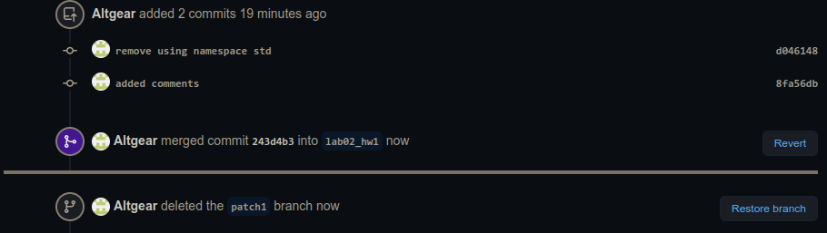
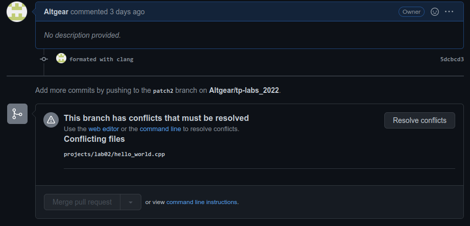

## Laboratory work II

Данная лабораторная работа посвещена изучению систем контроля версий на примере **Git**.

```bash
$ open https://git-scm.com
```

## Tasks

- [x] 1. Создать публичный репозиторий с названием **lab02** и с лиценцией **MIT**
- [x] 2. Сгенирировать токен для доступа к сервису **GitHub** с правами **repo**
- [x] 3. Ознакомиться со ссылками учебного материала
- [x] 4. Выполнить инструкцию учебного материала
- [x] 5. Составить отчет и отправить ссылку личным сообщением в **Slack**

## Tutorial

```sh
#  вводим переменные в Терминал
$ export GITHUB_USERNAME=<имя_пользователя>
$ export GITHUB_EMAIL=<адрес_почтового_ящика>
$ export GITHUB_TOKEN=<сгенирированный_токен>
# делаем ссылку edit на свой тексовый редактор
$ alias edit=<nano|vi|vim|subl>
```

```sh
$ cd ${GITHUB_USERNAME}/workspace
# активируем скрипты для добавлления npm в PATH
## Только зачем, если все через gist?
$ source scripts/activate
```

```sh
$ mkdir ~/.config
# записываем конфигурационный фаил hub
## Но в этой лабе я его не использую
$ cat > ~/.config/hub <<EOF
github.com:
- user: ${GITHUB_USERNAME}
  oauth_token: ${GITHUB_TOKEN}
  protocol: https
EOF
$ git config --global hub.protocol https
```

```sh
$ mkdir -p projects/lab02 && cd projects/lab02
# создаем локальный репозиторий
$ git init
# настраиваем локальный репозиторий
$ git config --global user.name ${GITHUB_USERNAME}
$ git config --global user.email ${GITHUB_EMAIL}
# check your git global settings
$ git config -e --global
# указываем адресс удаленного репозитория
$ git remote add origin https://github.com/${GITHUB_USERNAME}/lab02.git
# подтяиваем файлы из удаленного репозитория
$ git pull origin master
# создаем фаил
$ touch README.md
$ git status
# добавляем фаил в отслеживаемые
$ git add README.md
# Фиксируем изменения
$ git commit -m "added README.md"
# отправляем коммиты на удаленный репозиторий
$ git push origin master
```

Добавить на сервисе **GitHub** в репозитории **lab02** файл **.gitignore**
со следующем содержимом:

```sh
*build*/
*install*/
*.swp
.idea/
```

```sh
$ git pull origin master
$ git log
```

```sh
$ mkdir sources
$ mkdir include
$ mkdir examples
$ cat > sources/print.cpp <<EOF
#include <print.hpp>

void print(const std::string& text, std::ostream& out)
{
  out << text;
}

void print(const std::string& text, std::ofstream& out)
{
  out << text;
}
EOF
```

```sh
$ cat > include/print.hpp <<EOF
#include <fstream>
#include <iostream>
#include <string>

void print(const std::string& text, std::ofstream& out);
void print(const std::string& text, std::ostream& out = std::cout);
EOF
```

```sh
$ cat > examples/example1.cpp <<EOF
#include <print.hpp>

int main(int argc, char** argv)
{
  print("hello");
}
EOF
```

```sh
$ cat > examples/example2.cpp <<EOF
#include <print.hpp>

#include <fstream>

int main(int argc, char** argv)
{
  std::ofstream file("log.txt");
  print(std::string("hello"), file);
}
EOF
```

```sh
$ edit README.md
```

```sh
$ git status
$ git add .
# Делаем коммит
$ git commit -m "added sources"
# отправляем файлы на github
$ git push origin master
```

## Report

```sh
$ cd ~/workspace/
$ export LAB_NUMBER=02
$ git clone https://github.com/tp-labs/lab${LAB_NUMBER}.git tasks/lab${LAB_NUMBER}
$ mkdir reports/lab${LAB_NUMBER}
$ cp tasks/lab${LAB_NUMBER}/README.md reports/lab${LAB_NUMBER}/REPORT.md
$ cd reports/lab${LAB_NUMBER}
$ edit REPORT.md
$ gist REPORT.md
```

## Homework

### Part I

1. Создайте пустой репозиторий на сервисе github.com (или gitlab.com, или bitbucket.com).
2. Выполните инструкцию по созданию первого коммита на странице репозитория, созданного на предыдещем шаге.
```bash
$ echo "Lab02_hw" >> README.md
```
3. Создайте файл `hello_world.cpp` в локальной копии репозитория (который должен был появиться на шаге 2). Реализуйте программу **Hello world** на языке C++ используя плохой стиль кода. Например, после заголовочных файлов вставьте строку `using namespace std;`.
```bash
$ vim hello_world.cpp
$ cat hello_world.cpp
```
```cpp
#include <iostream>

using namespace std;

int main() {
	cout << "Hello world!" << endl;
}
```
4. Добавьте этот файл в локальную копию репозитория.
```bash
$ git add hello_world.cpp
```
5. Закоммитьте изменения с *осмысленным* сообщением.
```bash
git commit -m "created Hello_world.cpp"
```
6. Изменитьте исходный код так, чтобы программа через стандартный поток ввода запрашивалось имя пользователя. А в стандартный поток вывода печаталось сообщение `Hello world from @name`, где `@name` имя пользователя.
```bash
$ vim hello_world.cpp
$ cat hello_world.cpp
```
```cpp
#include <iostream>
#include <string>

using namespace std;

int main() {
	string username;
	cin >> username;
	cout << "Hello world from " << username << "!" << endl;
}
```
7. Закоммитьте новую версию программы. Почему не надо добавлять файл повторно `git add`?
```bash
$ git add hello_world.cpp // вообще-то надо
$ git commit -m "changed Hello_world.cpp"
```
8. Запуште изменения в удалёный репозиторий.
```bash
$ git push origin lab02_hw1
```
9. Проверьте, что история коммитов доступна в удалёный репозитории.
```
commit 81df9c883ee9ed83c9199de8307e31ebe90415d2 (HEAD -> lab02_hw1, origin/lab02_hw1)
```

### Part II

**Note:** *Работать продолжайте с теми же репоззиториями, что и в первой части задания.*
1. В локальной копии репозитория создайте локальную ветку `patch1`.
```bash
$ git checkout -b patch1
```
2. Внесите изменения в ветке `patch1` по исправлению кода и избавления от `using namespace std;`.
```bash
$ vim hello_world.cpp
$ cat hello_world.cpp
```
```cpp
#include <iostream>
#include <string>

int main() {
	std::string username;
	std::cin >> username;
	std::cout << "Hello world from " << username << "!" << std::endl;
}
```
3. **commit**, **push** локальную ветку в удалённый репозиторий.
```bash
$ git add hello_world.cpp
$ git commit -m "remove using namespace std"
$ git push origin patch1
```
4. Проверьте, что ветка `patch1` доступна в удалёный репозитории.
```
commit d0461483d8413e6fe9a623b9858a94dab4c89cde (HEAD -> patch1, origin/patch1)
```
5. Создайте pull-request `patch1 -> lab02_hw1`.

6. В локальной копии в ветке `patch1` добавьте в исходный код комментарии.
```bash
$ vim hello_world.cpp
$ cat hello_world.cpp
```
```cpp
#include <iostream>
#include <string>


int main() {
	std::string username; // храним имя пользователя
	std::cin >> username; // вводим имя
	std::cout << "Hello world from " << username << "!" << std::endl;
}

```
7. **commit**, **push**.
```bash
$ git add hello_world.cpp
$ git commit -m "added comments"
$ git push origin patch1
```
8. Проверьте, что новые изменения есть в созданном на **шаге 5** pull-request

9. В удалённый репозитории выполните  слияние s_PR `patch1 -> lab02_hw1` и удалите ветку `patch1` в удаленном репозитории.


10. Локально выполните **pull**.
```bash
$ git checkout lab02_hw1
$ git pull origin lab02_hw1
```
11. С помощью команды **git log** просмотрите историю в локальной версии ветки `lab02_hw1`.
```bash
$ git log
commit 243d4b39b86f6b16911ece73714c6ffeb6b8a798 (HEAD -> lab02_hw1, origin/lab02_hw1)
Merge: 81df9c8 8fa56db
. . .
    Merge pull request #1 from Altgear/patch1

    remove using namespace std
```
12. Удалите локальную ветку `patch1`.
```bash
$ git branch -d patch1
```

### Part III

**Note:** *Работать продолжайте с теми же репоззиториями, что и в первой части задания.*
1. Создайте новую локальную ветку `patch2`.
```bash
$ git checkout -b patch2
```
2. Измените *code style* с помощью утилиты [**clang-format**](http://clang.llvm.org/docs/ClangFormat.html). Например, используя опцию `-style=Mozilla`.
```bash
$ clang-format hello_world.cpp -style=Mozilla -i
$ cat hello_world.cpp
```
```cpp
#include <iostream>
#include <string>

int
main()
{
  std::string username; // храним имя пользователя
  std::cin >> username; // вводим имя
  std::cout << "Hello world from " << username << "!" << std::endl;
}
```
3. **commit**, **push**, создайте pull-request `patch2 -> lab02_hw1`.
```bash
$ git add hello_world.cpp
$ git commit -m "formated with clang"
$ git push origin patch2
```

4. В ветке **master** в удаленном репозитории измените комментарии, например, расставьте знаки препинания, переведите комментарии на другой язык.
5. Убедитесь, что в pull-request появились *конфликтны*.

6. Для этого локально выполните **pull** + **rebase** (точную последовательность команд, следует узнать самостоятельно). **Исправьте конфликты**.
```bash
$ git checkout lab02_hw1
$ git pull origin lab02_hw1
$ git rebase lab02_hw1 patch2
$ cat hello_world.cpp
```

```cpp
#include <iostream>
#include <string>

<<<<<<< HEAD

int main() {
        std::string username; // string to save userame
        std::cin >> username; // entering username
        std::cout << "Hello world from " << username << "!" << std::endl;
=======
int
main()
{
  std::string username; // храним имя пользователя
  std::cin >> username; // вводим имя
  std::cout << "Hello world from " << username << "!" << std::endl;
>>>>>>> formated with clang
}

```

```bash
$ vim hello_world.cpp
$ git add hello_world.cpp
$ git rebase --continue
Applying: formated with clang
$ cat hello_world.cpp
```

```cpp
#include <iostream>
#include <string>

int main() {
	std::string username; // string to save userame
	std::cin >> username; // entering username
	std::cout << "Hello world from " << username << "!" << std::endl;
}
```
7. Сделайте *force push* в ветку `patch2`
```bash
$ git push -f origin patch2
```
8. Убедитель, что в pull-request пропали конфликтны.

9. Вмержите pull-request `patch2 -> lab02_hw1`.


## Links

- [hub](https://hub.github.com/)
- [GitHub](https://github.com)
- [Bitbucket](https://bitbucket.org)
- [Gitlab](https://about.gitlab.com)
- [LearnGitBranching](http://learngitbranching.js.org/)

```
Copyright (c) 2015-2021 The ISC Authors
```
